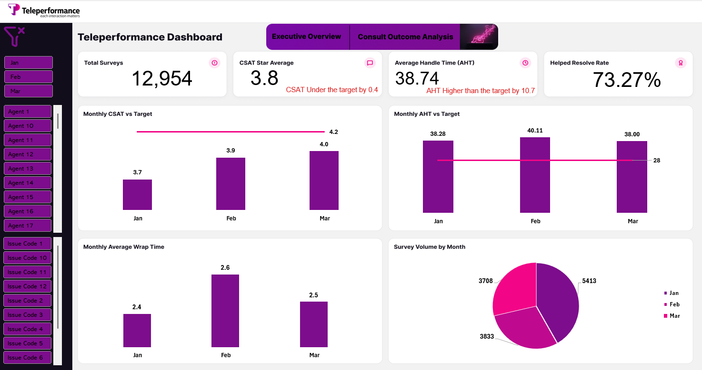
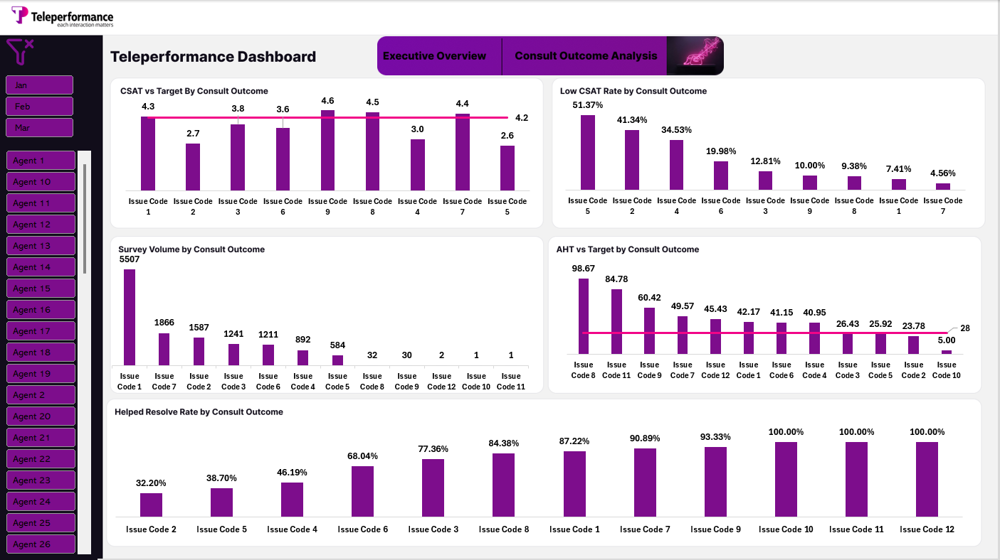

# ☎️ Teleperformance Customer Support Analytics

> An Excel-based customer support analytics dashboard designed to monitor CSAT,
> Average Handle Time (AHT), Helped Resolve Rate, survey volume, and consult
> outcome performance.

---

## 📌 Project Overview

This project analyzes customer support performance for Teleperformance
using customer survey and consultation outcome data.

The dashboard focuses on understanding customer satisfaction,
support efficiency, and the performance of different consult outcomes.

The analysis helps identify the consult outcomes associated with:

- Low customer satisfaction
- High handling time
- Low resolution rates
- High or low survey volume

---

## 🎯 Business Questions

The analysis aims to answer the following questions:

- Is customer satisfaction meeting the target?
- Is Average Handle Time (AHT) within the target?
- How does CSAT change over time?
- Which consult outcomes have the highest low-CSAT rates?
- Which consult outcomes require the most handling time?
- Which consult outcomes have the lowest Helped Resolve Rate?
- How does survey volume vary across months and consult outcomes?
- Which consult outcomes require deeper investigation?

---

## 🗂️ Dataset

The dataset contains customer support consultation,
survey, agent, and performance-related information.

### Main Data Areas

| Data Area | Description |
|---|---|
| Consult Outcomes | Issue / consultation outcome associated with each interaction |
| Customer Surveys | Survey results and customer satisfaction ratings |
| Agents | Agent-related information |
| Performance Metrics | Work time, wrap time, AHT and resolution metrics |
| Time | Monthly performance and survey trends |

---

## 🛠️ Tools & Technologies

- Microsoft Excel
- Pivot Tables
- data model
- Power query
- Pivot Charts
- Excel Formulas
- Dashboard Design
- Data Analysis
- Data Visualization

---

# 🔄 Data Preparation

The data was prepared and structured for analysis by:

- Reviewing data quality and consistency
- Organizing consultation outcome categories
- Preparing survey metrics
- Calculating performance KPIs
- Creating monthly analysis
- Preparing data for Pivot Tables and dashboard visualizations

---

# 🧩 Data Model


### Model Overview

[This is a star-schema model with two fact tables — **AHT Data**
(handling time, wrap time, chat volume) and **Survey Data**
(CSAT, star ratings, Helped Resolve Rate) — connected through
shared dimension tables:

- **Month** — date table linking both fact tables for monthly trends
- **Consult_Outcome** — links both fact tables by Issue Code, enabling
  cross-analysis between handling efficiency and satisfaction
- **Hire Dates** — agent lookup table, linked to AHT Data via Agent

Because both fact tables share `Month` and `Consult_Outcome`, the
model supports comparing AHT and CSAT side by side for the same
consult outcome or time period.]

The model connects customer survey data with consultation outcomes,
agent information, and performance metrics to support cross-analysis.

---

# 📊 Dashboard

The dashboard consists of **2 analytical pages**:

1. Executive Overview
2. Consult Outcome Analysis

---

# 📄 Page 1 — Executive Overview



### Purpose

The Executive Overview provides a high-level view of customer support
performance and tracks the main KPIs against their targets.

### Key KPIs

| KPI | Result | Target |
|---|---:|---:|
| Total Surveys | 12,954 | — |
| CSAT Star Average | 3.8 | 4.2 |
| Average Handle Time (AHT) | 38.74 min | 28 min |
| Helped Resolve Rate | 73.27% | — |

### Monthly Performance

| Month | CSAT | AHT | Avg. Wrap Time |
|---|---:|---:|---:|
| January | 3.7 | 38.28 | 2.4 |
| February | 3.9 | 40.11 | 2.6 |
| March | 4.0 | 38.00 | 2.5 |

### Key Findings

- Overall CSAT was **3.8**, below the target of **4.2**.
- Average Handle Time was **38.74 minutes**, above the target of **28 minutes**.
- CSAT improved from **3.7 in January to 4.0 in March**.
- AHT peaked at **40.11 minutes in February**.
- March recorded the lowest AHT at **38.00 minutes**.
- Helped Resolve Rate reached **73.27%**.
- January had the highest survey volume with **5,413 surveys**.

---

# 📄 Page 2 — Consult Outcome Analysis



### Purpose

This page provides a deeper analysis of performance by consult outcome
to identify which issue types are associated with customer dissatisfaction,
long handling times, and lower resolution rates.

---

## ⭐ CSAT by Consult Outcome

The analysis shows considerable variation in customer satisfaction
across consult outcomes.

| Consult Outcome | CSAT |
|---|---:|
| Issue Code 9 | 4.6 |
| Issue Code 8 | 4.5 |
| Issue Code 7 | 4.4 |
| Issue Code 1 | 4.3 |
| Issue Code 3 | 3.8 |
| Issue Code 6 | 3.6 |
| Issue Code 4 | 3.0 |
| Issue Code 2 | 2.7 |
| Issue Code 5 | 2.6 |

### Key Finding

Issue Codes **5, 2, and 4** show the lowest CSAT values,
with scores of **2.6, 2.7, and 3.0** respectively.

---

## ⚠️ Low CSAT Rate by Consult Outcome

| Consult Outcome | Low CSAT Rate |
|---|---:|
| Issue Code 5 | 51.37% |
| Issue Code 2 | 41.34% |
| Issue Code 4 | 34.53% |
| Issue Code 6 | 19.98% |
| Issue Code 3 | 12.81% |
| Issue Code 9 | 10.00% |
| Issue Code 8 | 9.38% |
| Issue Code 1 | 7.41% |
| Issue Code 7 | 4.56% |

### Key Finding

Issue Code 5 has the highest low-CSAT rate at **51.37%**,
followed by Issue Code 2 at **41.34%** and Issue Code 4 at **34.53%**.

---

## ⏱️ AHT by Consult Outcome

Some consult outcomes require significantly more handling time
than others.

| Consult Outcome | AHT |
|---|---:|
| Issue Code 8 | 98.67 min |
| Issue Code 11 | 84.78 min |
| Issue Code 9 | 60.42 min |
| Issue Code 7 | 49.57 min |
| Issue Code 12 | 45.43 min |
| Issue Code 1 | 42.17 min |
| Issue Code 6 | 41.15 min |
| Issue Code 4 | 40.95 min |
| Issue Code 3 | 26.43 min |
| Issue Code 5 | 25.92 min |
| Issue Code 2 | 23.78 min |
| Issue Code 10 | 5.00 min |

### Key Finding

Issue Code 8 has the highest AHT at **98.67 minutes**,
which is significantly above the overall target of **28 minutes**.

---

## 📈 Helped Resolve Rate by Consult Outcome

The Helped Resolve Rate varies considerably across consult outcomes.

The lowest rates are:

- **Issue Code 2 — 32.20%**
- **Issue Code 5 — 38.70%**
- **Issue Code 4 — 46.19%**
- **Issue Code 6 — 68.04%**

Several lower-volume issue codes reached **100%**, but their survey
volumes are very small and should therefore be interpreted carefully.

---

## 📊 Survey Volume by Consult Outcome

The highest survey volumes were concentrated in a small number of
consult outcomes:

| Consult Outcome | Survey Volume |
|---|---:|
| Issue Code 1 | 5,507 |
| Issue Code 7 | 1,866 |
| Issue Code 2 | 1,587 |
| Issue Code 3 | 1,241 |
| Issue Code 6 | 1,211 |
| Issue Code 4 | 892 |
| Issue Code 5 | 584 |

### Key Finding

Issue Code 1 accounts for the largest survey volume with **5,507 surveys**,
while Issue Codes 8–12 have very small volumes.

---

# 💡 Key Insights

### 1. Overall Customer Satisfaction Is Below Target

Overall CSAT is **3.8**, compared with the target of **4.2**.

However, monthly CSAT improved from **3.7 in January to 4.0 in March**.

### 2. Handling Time Is Above Target

Overall AHT is **38.74 minutes**, compared with the target of **28 minutes**.

Issue Code 8 has the highest AHT at **98.67 minutes**.

### 3. Low CSAT Is Concentrated in Specific Consult Outcomes

Issue Codes **5, 2, and 4** have the highest low-CSAT rates and
the lowest CSAT scores among the major issue categories.

### 4. Resolution Performance Varies by Issue

Issue Code 2 has the lowest Helped Resolve Rate at **32.20%**,
followed by Issue Code 5 at **38.70%**.

### 5. Survey Volume Is Highly Concentrated

Issue Code 1 has **5,507 surveys**, making it the largest contributor
to the analyzed survey volume.

---

# 📈 Business Recommendations

Based on the analysis, areas for further investigation include:

- Investigating the root causes behind the low CSAT rates of Issue Codes 5, 2, and 4.
- Reviewing the process complexity behind the high AHT of Issue Code 8.
- Investigating the low Helped Resolve Rates of Issue Codes 2, 5, and 4.
- Monitoring high-volume issue categories separately from low-volume categories.
- Tracking monthly CSAT and AHT trends against their respective targets.

---

# 📁 Repository Structure

```text
📦 Teleperformance-Customer-Support-Analytics
│
├── 📂 Dashboard
│   └── Teleperformance Dashboard pages
│
├── 📂 Dataset
│   └── dataset.xlsx
│
├── 📂 Images
│   ├── data-model.png
└── 📜 README.md
